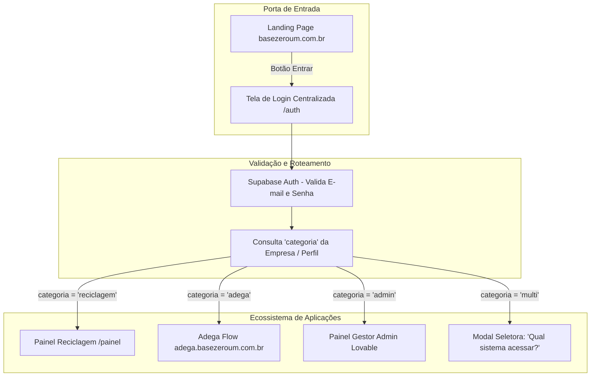

# Plano de Ação: Arquitetura Multi-Segmento e Login Inteligente (Base Zero Um)

Este documento reúne o planejamento estratégico e técnico para unificar o acesso aos diferentes sistemas da **Base Zero Um** (Reciclagem, futuras Adegas, Financeiro e Painel Admin), mantendo escalabilidade, baixo custo e facilidade de desenvolvimento no Lovable.

---

## 1. Visão Geral da Arquitetura



### Decisões Arquiteturais Consolidadas:
1. **Onde fica o Login:** Permanece desacoplado da landing page de marketing (`b01-data-lead-gen`). Ele roda na aplicação central (atualmente no repositório `recycle-flow-base`, que passará a atuar como Hub de Acesso).
2. **Estratégia de Banco de Dados:** **Multi-tenant com Banco Centralizado (RLS)**.
   * Não criar bancos Supabase separados por cliente nem por segmento nesta fase.
   * Os dados de cada cliente já estão 100% protegidos e isolados através do `empresa_id` e das políticas de **Row-Level Security (RLS)** nativas do PostgreSQL.
   * Permite que o futuro **Painel Admin (Lovable)** gerencie todos os clientes, usuários e permissões em um único lugar.
3. **Identificação por Categoria:** Cada empresa/usuário possui uma propriedade que determina a quais módulos ela tem acesso.

---

## 2. Passo a Passo de Implementação

### Fase 1: Ajuste no Banco de Dados (Supabase)

Adicionar a definição de segmento/categoria na tabela `empresas` para classificar o tipo de cliente:

```sql
-- 1. Adiciona a coluna de categoria na tabela empresas
ALTER TABLE public.empresas 
ADD COLUMN IF NOT EXISTS categoria text NOT NULL DEFAULT 'reciclagem';

-- Comentário explicativo dos valores aceitos
COMMENT ON COLUMN public.empresas.categoria IS 'Valores: reciclagem, adega, financeiro, multi, admin';

-- 2. (Opcional) Se quiser permitir múltiplos módulos contratados por empresa:
ALTER TABLE public.empresas 
ADD COLUMN IF NOT EXISTS modulos_ativos text[] DEFAULT ARRAY['reciclagem']::text[];
```

---

### Fase 2: Roteador Inteligente Pós-Login

Atualizar o fluxo de login em [auth.tsx](file:///c:/Users/brend/Desktop/Projetos%20Open%20Source/recycle-flow-base/src/routes/auth.tsx):

1. **Autenticar credenciais** com `supabase.auth.signInWithPassword`.
2. **Consultar o perfil e empresa do usuário:**
   ```typescript
   const { data: profile } = await supabase
     .from("profiles")
     .select("id, empresa:empresas(id, categoria, modulos_ativos)")
     .eq("id", data.user.id)
     .single();
   ```
3. **Executar o redirecionamento condicional:**
   * **`reciclagem`:** `navigate({ to: "/painel", replace: true })`
   * **`adega`:** `window.location.href = "https://adega.basezeroum.com.br"`
   * **`admin`:** `window.location.href = "https://admin.basezeroum.com.br"`
   * **`multi`:** Abre o componente de seleção de sistemas na tela.

---

### Fase 3: Sessão Única entre Subdomínios (SSO)

Para que o usuário autenticado em um subdomínio não precise digitar a senha novamente ao ser redirecionado para outro (ex.: de `app.basezeroum.com.br` para `adega.basezeroum.com.br`):

No cliente Supabase (`src/integrations/supabase/client.ts`):
```typescript
export const supabase = createClient(SUPABASE_URL, SUPABASE_ANON_KEY, {
  auth: {
    storageKey: 'b01-session-token',
    cookieOptions: {
      domain: '.basezeroum.com.br', // Ponto na frente abrange todos os subdomínios
      sameSite: 'lax',
      secure: true,
    },
  },
});
```

---

### Fase 4: Conectar a Landing Page (`b01-data-lead-gen`)

1. Manter a landing page leve, focada em SEO e captação de leads.
2. Na rota [portal.tsx](file:///c:/Users/brend/Desktop/Projetos%20Open%20Source/b01-data-lead-gen/src/routes/portal.tsx) e nos botões "Entrar" do cabeçalho:
   * Direcionar para a URL do login centralizado (ex.: `https://app.basezeroum.com.br/auth` ou `https://reciclagem.basezeroum.com.br/auth`).

---

### Fase 5: O Painel Admin no Lovable

Quando você for criar o Painel Admin no Lovable:
1. **Conectar ao mesmo projeto Supabase.**
2. **Criar a interface de Gestão de Clientes:**
   * Tabela listando todas as `empresas` e `profiles`.
   * Campo de seleção (Dropdown/Switch) para alterar `categoria` ou ativar/desativar módulos (`reciclagem`, `adega`, etc.).
   * Visualização rápida de status da conta (`ativa`, `trial_ate`).
3. **Segurança:** Apenas usuários com a role `admin` global na tabela `user_roles` podem acessar esse painel.

---

## 3. Preparação para o Novo Segmento (Adega)

Quando for desenvolver a aplicação da Adega:
1. **Conectar ao mesmo Supabase.**
2. **Criar as tabelas específicas da Adega:**
   * `adega_produtos` (nome, tipo_uva, safra, estoque_minimo)
   * `adega_lotes` (lote, data_fabricacao, validade, quantidade)
   * `adega_movimentacoes` (tipo, quantidade, motivo)
3. Todas as novas tabelas devem incluir a coluna `empresa_id` com a política RLS padrão:
   ```sql
   ALTER TABLE public.adega_produtos ENABLE ROW LEVEL SECURITY;
   CREATE POLICY "adega_produtos_empresa" ON public.adega_produtos
     FOR ALL TO authenticated
     USING (empresa_id = public.current_empresa_id())
     WITH CHECK (empresa_id = public.current_empresa_id());
   ```

---

## 4. Checklist de Execução Futura

- [x] Rodar a migration para adicionar a coluna `categoria` na tabela `empresas`.
- [x] Atualizar `src/routes/auth.tsx` para incluir a verificação de categoria após login.
- [x] Configurar cookies compartilhados (`.basezeroum.com.br`) no cliente Supabase.
- [ ] Atualizar o botão de acesso na Landing Page para apontar para o login unificado.
- [ ] Criar o projeto do Painel Admin no Lovable conectado ao banco central.
- [ ] Criar o projeto da Adega reaproveitando o mesmo banco e as políticas RLS.
